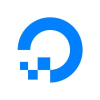

# Hi there, Welcome to my Github👋

I'm **[Raul Novelo](https://www.linkedin.com/in/rnoveloc/)**, a human being who is passionate about simplifying things through technology.
I've experience in Software Engineer, Data Science and Web Developement. Having deep knowledge with frameworks like Vue.js/Node.js/Django.
Community leader, open-source collaborator, and author for technical articles.

I am also looking to contribute to open-source projects to improve my skills and also work on interesting projects that will enhance my skills listed in the Skills section.

## Stats

**Have a look on my [portfolio](http://rnoveloc.esy.es/).**
<nobr>

</nobr>

## Skills

### Frameworks FrontEnd :package:

|  |  |  |  |  |  |
| -------------------------------------------------------------------------- | ---------------------------------------------------------------------------- | ----------------------------------------------------------------------------------- | --------------------------------------------------------------------------------- | ---------------------------------------------------------------------------------------------- | ---------------------------------------------------------------------------------------------- |

### Frameworks BackEnd :package:

|  |  |  |  |
| ---------------------------------------------------------------------------------- | --------------------------------------------------------------------------- | -------------------------------------------------------------------------------------------- | ------------------------------------------------------------------------------------------------- |

### Programming Languages :computer:

|  |  |  |  |  |
| --------------------------------------------------------------------------------------------------------------------- | ------------------------------------------------------------------------------------- | -------------------------------------------------------------------------------- | --------------------------------------------------------------------------- | -------------------------------------------------------------------------------------------- |

### Databases :floppy_disk:

|  |  |  |  |
| --------------------------------------------------------------------------------------------- | ---------------------------------------------------------------------------------- | -------------------------------------------------------------------------------------- | ----------------------------------------------------------------------------------------------- |

### Tools & other technologies :hammer_and_wrench:

|  |  |  |  |
| ---------------------------------------------------------------------------- | -------------------------------------------------------------------------- | ------------------------------------------------------------------------------------- | --------------------------------------------------------------------------------- |

### Cloud :cloud:

|  |  |  |
| ------------------------------------------------------------------------------- | ---------------------------------------------------------------------------------------------- | --------------------------------------------------------------------------------- |

## Facts

Here are some ideas to get you started:

- 🔭 I’m currently working on: **[@aaaimx](https://www.aaaimx.org) as Software Leader & mentor of the community members**
- 🌱 I’m currently learning: **Python/Django, MEVN Stack, VueJS to develop Full-Stack web applications**
- 👯 I’m looking to collaborate on: **Open-source projects.**
- 💬 Ask me about: **Things you would like to know about me, ask me questions about my Software Engineering projects and other things that interests you or what you would like to find out more.**
- 🤔 I’m looking for: **help with jobs/intern.**
- 📫 How to reach me: **Connect with me on [Facebook](https://www.facebook.com/raul.novelocruz)** / **[Linkedin](https://www.linkedin.com/in/rnoveloc)**
- ⚡ Fun fact: **I love cold coffee. 😄**

### :handshake: Always happy to help!

### :hugs: Thank You!

Thank you so much for visiting my tiny space on [GitHub](https://github.com/rnovec)! :v:
